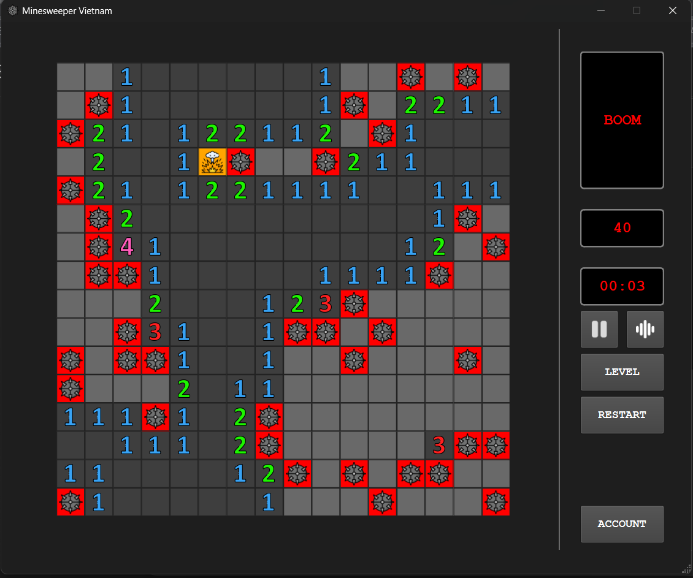
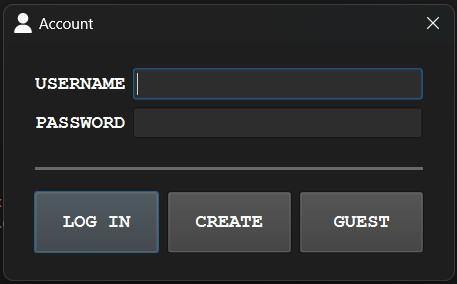
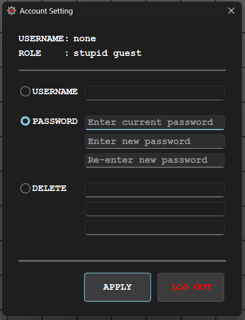
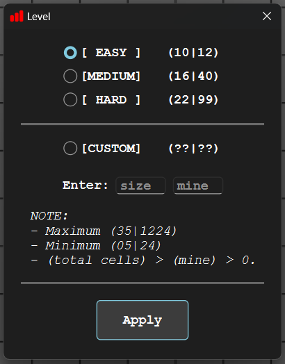

# Minesweeper Mini Game

A desktop Minesweeper game built with **C++, Qt framework, and MySQL**, featuring a modern UI, customizable levels, and an account system.

---

## Gameplay

---

## Account Login

---

## Account Settings

Account management features:

- Change username
- Update password
- Delete account
- Log out

---

## Level Selection

Difficulty levels:

- **Easy**, **Medium**, **Hard** 
- **Custom** — user-defined board size and mine count

---
